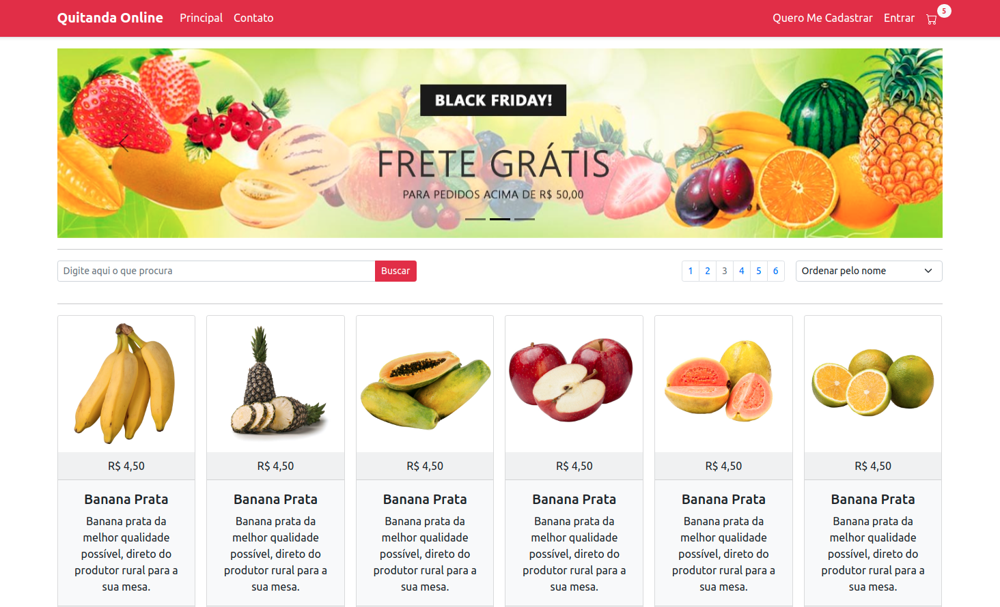
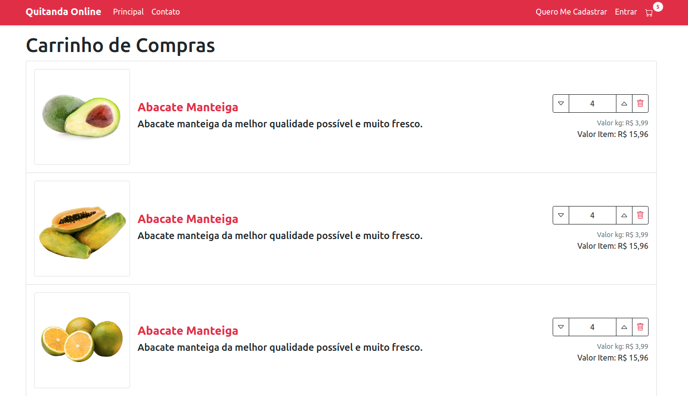
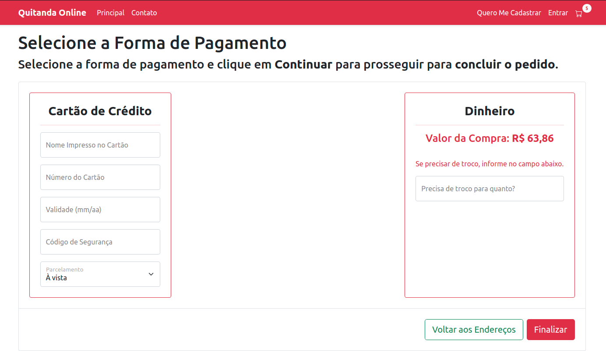
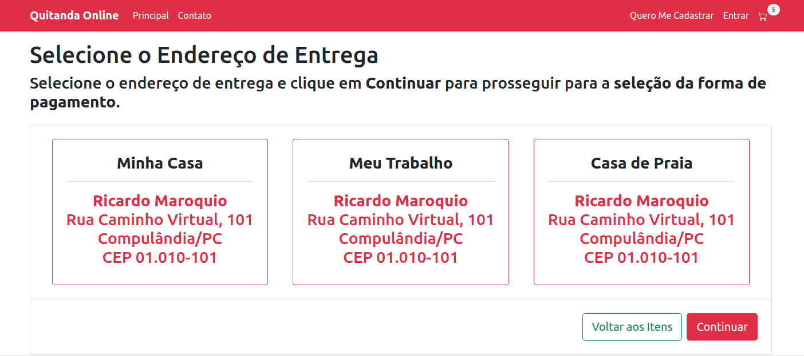
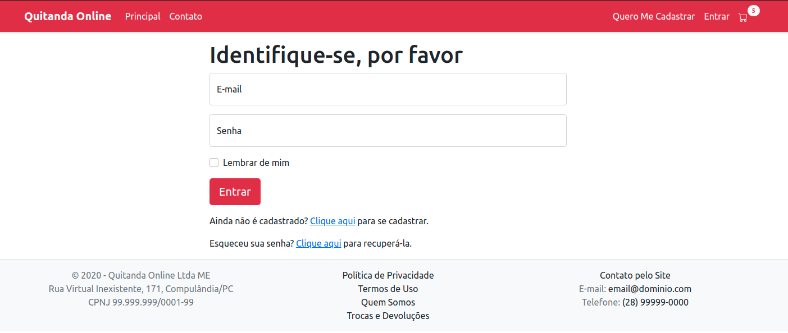
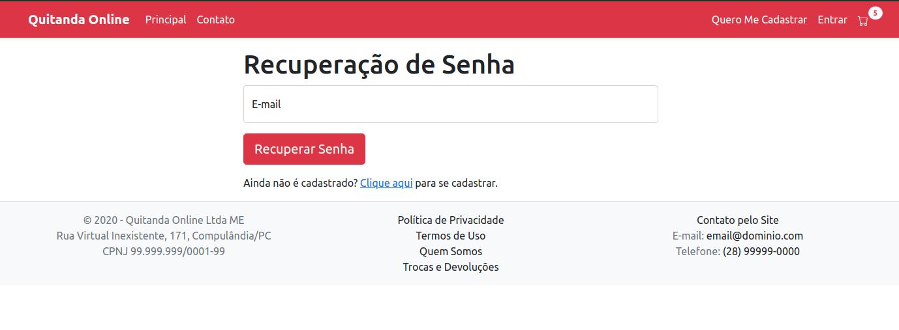
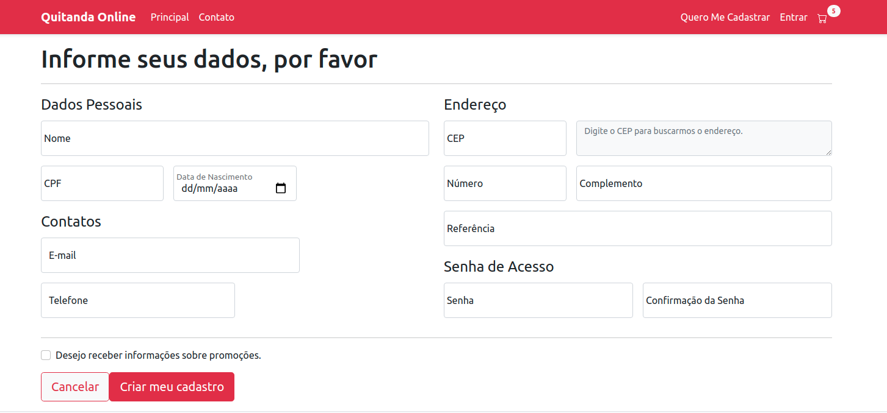

# Quitandas Online

## Sobre o projeto

Quitanda Online é uma loja virtual (e-commerce) fictícia e estática, criada com HTML, CSS, React, Router, ContextAPI, Hooks e Bootstrap. O objetivo principal foi aplicar ferramentas já conhecidas e aprender a utilizar o Bootstrap 5 em aplicação completa.

O Loyout da aplicação foi feita com base no curso curso ["Desenvolvimento de uma Loja Virtual com Bootstrap 5 e ASP.NET 5"](https://www.youtube.com/watch?v=SGqe6RixDcg) que é feito em HTML e Bootstrap.

## Layout

<h1 align="center">
  
  
  
  
  
  
  
</h1>

# Tecnologias utilizadas

## Front end

 &nbsp; &nbsp; &nbsp; &nbsp;
 &nbsp; &nbsp; &nbsp; &nbsp;
 &nbsp; &nbsp; &nbsp; &nbsp;
 &nbsp; &nbsp; &nbsp; &nbsp;

## Implantação em produção

 &nbsp; &nbsp; &nbsp; &nbsp;

# Como executar o projeto localmente

1º - Clone o [Repositório](https://github.com/renatomak/projeto-sds3) do projeto no GitHub

Pré-requisitos:
npm / yarn
Spring Tool Suite

## Frontend

3. Instale as dependências - npm install ou yarn install
4. Inicie o projeto - npm start ou yarn start

## Acesse: ["Quitanda Online"]()

## Proximos Passos

- Criar o backend e estabelecer a comunicação com o frontend.
